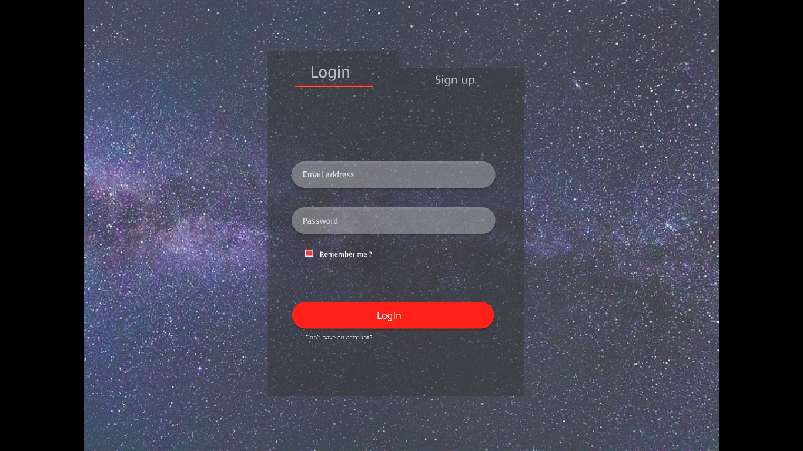
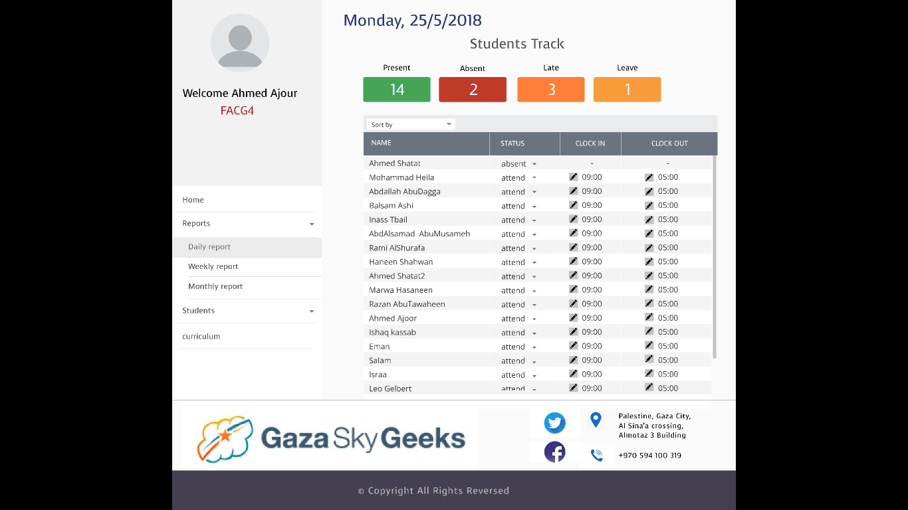
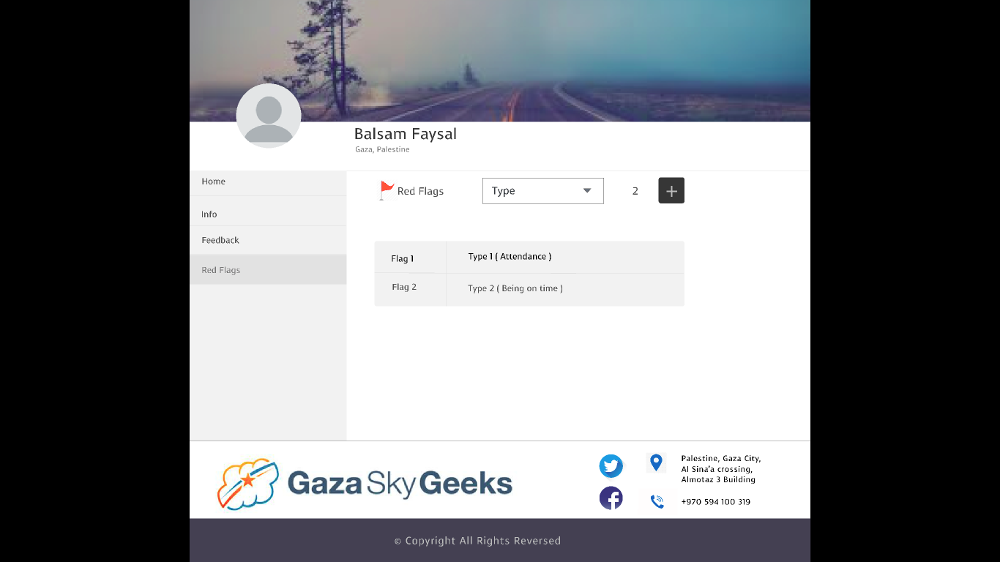

## FACGTracker

#### Our application is about :
1.  Tracking students attendance and their behavior .
2.  Improve learning process by giving and taking feedback from/to students .
3.  Notify students if they have a bad behavior by getting red flag .
4. Easier for facilitator to obtain student information .

#### The problem :
A better way of organizing the process of applying conducts and improve the adherence of code conducts .

 #### user stories :

 ###### As a facilitator I can :

* Add feedback :
  * He must to login to website .
  * From side navbar select the option 'students' .
  * View the list of all cohort students , every item in the list have student name and choice to open his profile or delete it
  * He click 'view profile' button he will directed for student profile .
  * Student profile displayed with side navbar ,if he choose the 'feedback' option ,he can add his feedback in text area and click on the button 'send' and it will be added on the list of feedback .  
* Login .
* Add red flag with its type .
* Daily ,Weekly ,Monthly report for Tracking students attendance .
* View students information .
* Invite students to register in the application .

#### Samples of our prototype :

There is the link of our prototype on figma website [Here ](https://www.figma.com/proto/FCcckCpvVWWkohq1R76ElzJO/FACG-tracker?node-id=45%3A20&scaling=contain)

#### The technology that we will use :
* Express .
* Postgres .
* Handle Bars .
* CSS .
